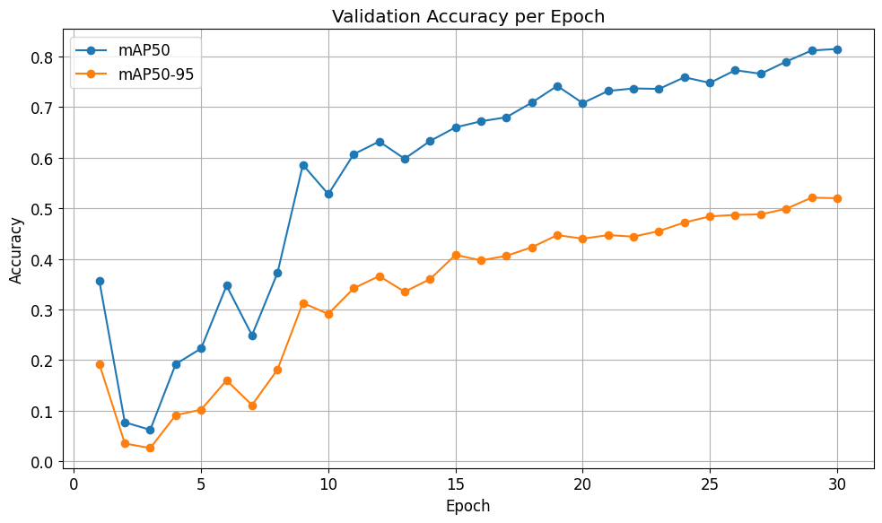

# YOLO 기반 포트홀 감지 시스템

## 1. 프로젝트 개요

도로 파손으로 인한 교통사고 및 유지보수의 비효율성 문제를 해결하고자 기반의 객체 YOLO

검출 시스템을 구축하였습니다.

## 2. 📚 데이터셋 정보 (Dataset Information)

이 프로젝트는 **KaggleHub**에서 확보한 포트홀 데이터셋을 기반으로 학습되었습니다.

- **데이터셋 규모:** 총 665장의 이미지
- **데이터 형식:** XML 라벨을 YOLO 형식으로 변환하여 사용
- **입력 해상도:** 416 x 416 (모델 학습 시 사용된 최종 해상도)
- **주요 특징:** 대부분 주간 환경, 근접 시야각의 포트홀 이미지를 포함함.

## 3. 핵심 결과 및 성능 지표

최종 모델인 YOLOv11-s의 검증 데이터셋 기준 성능입니다.

|지표|수치|설명|
|:---|:---:|---:|
|mAP50|0.815|IoU 50% 기준 평균 정확도로, 모델의 전반적인 탐지 능력|
|Precision|0.775|모델이 포트홀로 예측한 것 중 실제 포트홀인 비율 (신뢰도)|
|Recall|0.724|실제 포트홀 중 모델이 성공적으로 찾아낸 비율|
|Total Train Loss|3.224|30 Epoch 학습 후 최종 수렴된 총 학습 오차|

## 4. 결과 시각화


.png)

## 5. 성능 분석 및 한계점

높은 mAP에도 불구하고, 실제 운용에 필요한 수준의 신뢰도을 확보하지 못한 근본적인 문제점을 분석합니다.

1. 정밀도 부족 문제 (오탐지)
   + 모델의 정확도는 0.775로, 약 22.5%의 확률로 포트홀이 아닌 것을 포트홀로 잘못 판단하고 있습니다.
   + 도로의 화살표, 페인트, 복잡한 아스팔트의 크랙 등 포트홀과 유사한 시각적 특징에 대해 오탐지가 빈번히 발생할 수 있으며, 이는 시스템의 신뢰도 저해하는 주된 원인 입니다.
2. 데이터셋 규모 및 저해상도 한계 (미탐지)
   + 665장의 작은 데이터셋 규모가 파라미터가 많은 상위 모델(m, l)의 과적합을 유발했으며, s 모델 역시 30 Epoch 이후 추가적인 성능 개선의 천장에 도달했습니다.
   + 416 x 416의 낮은 입력 해상도와 근접 촬영 위주의 데이터셋 편향으로 인해, 멀리 있거나 경계가 애매한 포트홀의 미탐지(False Negative)율이 높게 나타났습니다.

## 6. 개선 방향
1. **데이터셋 확장 및 다양성 확보:** 야간, 우천, 원거리 촬영 이미지를 대폭 추가하여 모델의 강건성을 확보.
2. __입력 해상도 상향:__ 이미지 해상도를 640x640 이상으로 상향하여 미세 및 원거리 포트홀의 탐지 능력을 극대화.
3. __정밀도 최적화 전략:__ 탐지 임계값 재조정 및 Hard Negative Mining 기법을 적용하여 오탐지를 줄이고 정밀도를 강화.

## 7. 실행 방법

이 프로젝트는 Google Colab 환경에 최적화되어 있습니다.

### 7.1. Colab 환경에서 즉시 실행
프로젝트를 즉시 실행하고 모델을 테스트하려면 [여기](https://colab.research.google.com/drive/10AtdSNzbfZrE0abQDdohG2AZP2W-wq_M?authuser=0#scrollTo=3C9NFqnYApg9)를 클릭하십시오.

### 7.2. 환경 설정 및 탐지 실행 명령어

코랩 노트북 내에서 실행해야 하는 주요 단계별 명령어는 다음과 같습니다.

#### 1. 필수 라이브러리 설치

```
!pip install ultralytics
```

#### 2. 가중치 파일 로드 및 탐지 실행
최종 학습된 가중치 파일(best.pt)을 로드하고, 테스트 데이터에 대한 탐지를 실행합니다.

```
# 1. 모델 로드 (경로: weights/model.pt)
model = YOLO('weights/model.pt')

# 2. 탐지(Prediction) 실행
results = model.predict(
  source='data/5.jpg',
  conf=0.25,
  imgsz=416,
  save=True,
  exist_ok=True, # 기존에 폴더가 있어도 덮어쓰도록 허용
)
```

## 8. 🔗 참고 문헌 및 기여 (References / Credits)

이 프로젝트는 다음의 자료를 참고하여 진행되었습니다.

- **데이터 출처:** https://www.kaggle.com/datasets/chitholian/annotated-potholes-dataset/data
- **참고:** https://catch-sin.tistory.com/26
